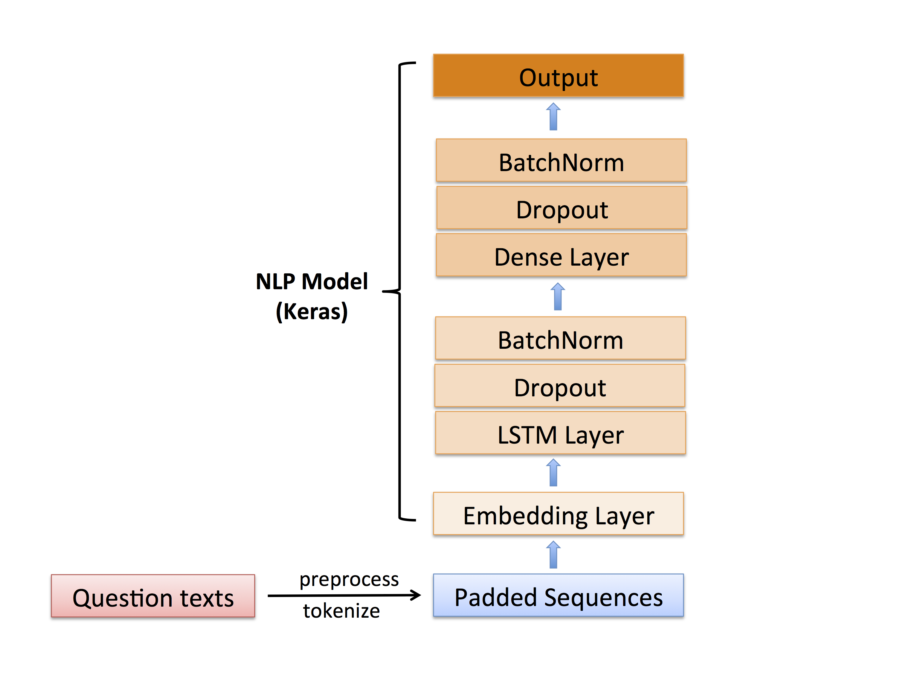

# [Quora Insincere Questions Classification](https://www.kaggle.com/c/quora-insincere-questions-classification) 

## Overview of the Problem 

This Kaggle competition requires a model for predicting whether a question asked on Quora is sincere or not. An insincere question is defined as a question intended to make a statement rather than look for helpful answers.

Examples of insincere questions:
* "In the United States, should being unemployed be a crime punishable by jail time?"
* "Does the entire global community want the USA dead for simply existing?"

This is a natural language processing (NLP) problem and therefore a deep learning model with recurrent layers is the best choice.

## My Solution

Here I provide a deep learning solution, which is fairly accurate (F1 score = 0.68) and runs fast (finishes in 25 min or even less on GPU provided by Kaggle). 

Key elements of the solution:

* Use Keras Tokenizer to transform words in a question to a sequence of numbers.   
* Use 300-dimensional [GloVe](https://nlp.stanford.edu/projects/glove/) for word embeddings. 
* Build a deep learning architecture featured with a LSTM (Long Short-Term Memory) recurrent layer followd by a fully connected dense layer.

Below is my model architecture.

## Dataset

[Quora Insincere Questions Data and Word Embeddings](https://www.kaggle.com/c/quora-insincere-questions-classification/data)
